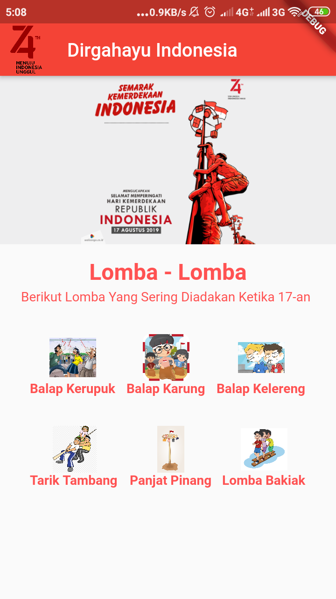

# Flutter UI & UX ( Tugas 2 - OSG08)

Aplikasi Flutter Mengenai Hari Kemerdekaan Indonesia yaitu Lomba-Lomba yang sering dilaksanakan pada hari kemerdekaan

### Screenshot

### Built With
- [Flutter](https://flutter.dev)

## Created By
Ikhsan Khoerul Rohman
